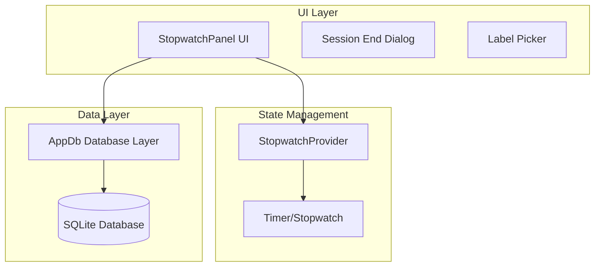
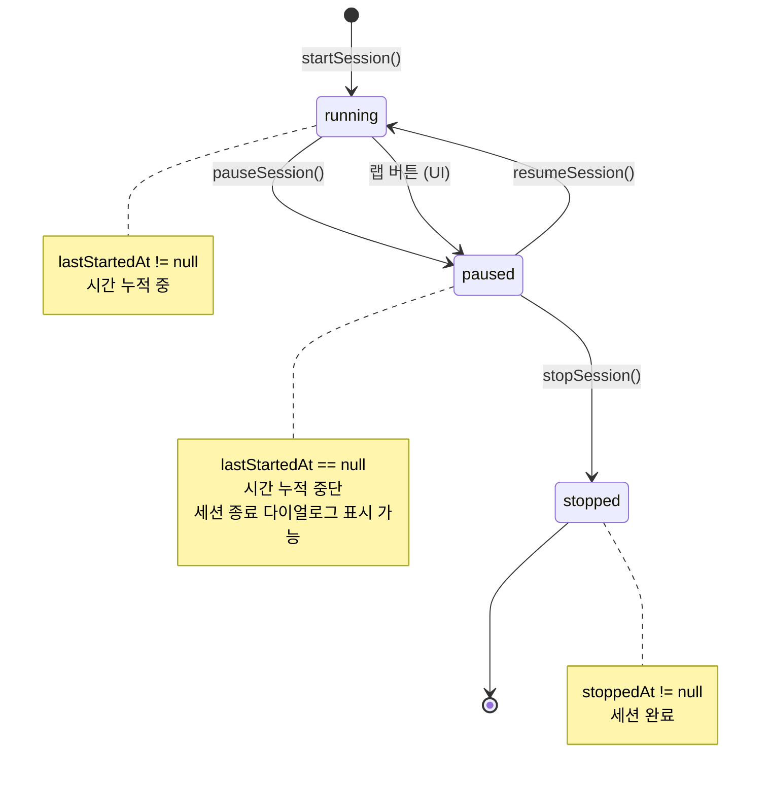

# 세션 관리 시스템 설계 문서

## 개요

세션 관리 시스템은 Flutter/Dart 기반의 Yarnie 앱에서 프로젝트별 작업 시간 추적을 담당하는 핵심 모듈입니다. 이 시스템은 Riverpod 상태 관리, Drift ORM을 통한 SQLite 데이터베이스, 그리고 Material Design 3 UI를 활용하여 정확하고 직관적인 시간 추적 경험을 제공합니다.

## 아키텍처

### 전체 아키텍처 다이어그램



### 레이어 구조

1. **UI Layer**: 사용자 인터페이스 및 상호작용
   - `StopwatchPanel`: 메인 스톱워치 UI 컴포넌트
   - 세션 종료 다이얼로그 및 라벨 선택기

2. **State Management Layer**: 애플리케이션 상태 관리
   - `StopwatchProvider`: Riverpod 기반 상태 관리
   - 실시간 타이머 및 UI 상태 동기화

3. **Data Layer**: 데이터 영속성 및 비즈니스 로직
   - `AppDb`: Drift ORM 기반 데이터베이스 접근
   - 세션 라이프사이클 관리 로직

## 컴포넌트 및 인터페이스

### 1. StopwatchProvider (상태 관리)

```dart
class StopwatchState {
  final Duration elapsed;
  final bool isRunning;
}

class StopwatchNotifier extends Notifier<StopwatchState> {
  // 핵심 메서드
  void start({Duration initialElapsed});
  void pause();
  void resume();
  void stop();
  void reset();
  void setElapsed(Duration elapsed);
}
```

**책임:**
- UI 타이머 상태 관리 (elapsed time, running status)
- 50ms 주기 실시간 업데이트
- 내부 Stopwatch와 baseTime 관리

### 2. AppDb (데이터베이스 레이어)

```dart
class AppDb extends _$AppDb {
  // 세션 라이프사이클 관리
  Future<int> startSession({required int projectId, String? label, String? memo});
  Future<int> pauseSession({required int projectId});
  Future<void> resumeSession({required int projectId});
  Future<void> stopSession({required int projectId, String? label, String? memo});
  
  // 세션 조회 및 관리
  Future<WorkSession?> getActiveSession(int projectId);
  Future<void> discardActiveSession({required int projectId});
  Future<Duration> totalElapsedDuration({required int projectId});
  
  // 스트림 기반 실시간 데이터
  Stream<List<WorkSession>> watchCompletedSessions(int projectId);
}
```

**책임:**
- 세션 상태 전환 로직 (start/pause/resume/stop)
- 데이터 무결성 보장 (프로젝트당 1개 활성 세션)
- 시간 계산 및 누적 로직

### 3. StopwatchPanel (UI 컴포넌트)

```dart
class StopwatchPanel extends ConsumerStatefulWidget {
  final List<String> initialLabels;
  final int projectId;
  
  // 핵심 UI 액션
  Future<void> _start();
  Future<int> _pause();
  Future<void> _saveLapFlow();
  Future<void> _resetSession();
}
```

**책임:**
- 사용자 인터랙션 처리
- 상태 관리자와 데이터베이스 조정
- 플랫폼별 UI 렌더링 (iOS/Android)

## 데이터 모델

### WorkSessions 테이블 스키마

```sql
CREATE TABLE work_sessions (
  id INTEGER PRIMARY KEY AUTOINCREMENT,
  project_id INTEGER NOT NULL,
  started_at INTEGER NOT NULL,        -- epoch milliseconds
  stopped_at INTEGER,                 -- epoch milliseconds (nullable)
  elapsed_ms INTEGER DEFAULT 0,       -- 누적 경과 시간 (ms)
  last_started_at INTEGER,            -- 마지막 시작 시각 (nullable)
  label TEXT,                         -- 세션 라벨 (nullable)
  memo TEXT,                          -- 세션 메모 (nullable)
  created_at INTEGER NOT NULL,        -- 생성 시각
  updated_at INTEGER,                 -- 수정 시각 (nullable)
  status INTEGER DEFAULT 1            -- SessionStatus enum index
);
```

### SessionStatus 열거형

```dart
enum SessionStatus {
  paused,   // 0: 활성 세션, 시간 멈춤
  running,  // 1: 활성 세션, 시간 흐름
  stopped,  // 2: 세션 완결
}
```

### 상태 전환 다이어그램



**UI 플로우에서의 세션 종료:**
- `running` 상태에서 랩 버튼 클릭 → 자동으로 `paused` 상태로 전환
- 세션 종료 다이얼로그 표시 (백그라운드에서 시간이 흐르지 않음)
- 사용자가 확인하면 `paused` → `stopped` 전환

## 에러 처리

### 1. 상태 전환 에러

```dart
// 잘못된 상태 전환 시 예외 발생
class StateError extends Error {
  final String message;
  StateError(this.message);
}

// 예시: 활성 세션이 없는데 pause 시도
if (activeSession == null || activeSession.status != SessionStatus.running) {
  throw StateError('RUNNING 세션이 없습니다.');
}
```

### 2. 데이터 무결성 에러

```dart
// 프로젝트당 1개 활성 세션 규칙 위반
Future<int> startSession({required int projectId}) async {
  final active = await getActiveSession(projectId);
  if (active != null) {
    throw StateError('활성 세션이 이미 존재합니다.');
  }
  // ... 세션 생성 로직
}
```

### 3. UI 레벨 에러 처리

```dart
// 사용자 친화적 에러 메시지 및 복구 옵션 제공
try {
  await _start();
} catch (e) {
  if (mounted) {
    ScaffoldMessenger.of(context).showSnackBar(
      SnackBar(content: Text('세션 시작 중 오류가 발생했습니다: $e')),
    );
  }
}
```

## 테스트 전략

### 1. 단위 테스트 (Unit Tests)

**StopwatchProvider 테스트:**
```dart
group('StopwatchProvider', () {
  test('should start timer with initial elapsed time', () {
    // Given
    final container = ProviderContainer();
    final notifier = container.read(stopwatchProvider.notifier);
    
    // When
    notifier.start(initialElapsed: Duration(minutes: 5));
    
    // Then
    expect(container.read(stopwatchProvider).isRunning, true);
    expect(container.read(stopwatchProvider).elapsed.inMinutes, 5);
  });
  
  test('should pause and preserve elapsed time', () {
    // Given
    final container = ProviderContainer();
    final notifier = container.read(stopwatchProvider.notifier);
    notifier.start();
    
    // When
    notifier.pause();
    
    // Then
    expect(container.read(stopwatchProvider).isRunning, false);
    expect(container.read(stopwatchProvider).elapsed, greaterThan(Duration.zero));
  });
});
```

**AppDb 세션 관리 테스트:**
```dart
group('Session Lifecycle', () {
  late AppDb db;
  
  setUp(() {
    db = AppDb(testConnection());
  });
  
  test('should create new session in running state', () async {
    // Given
    const projectId = 1;
    
    // When
    final sessionId = await db.startSession(projectId: projectId);
    final session = await db.getActiveSession(projectId);
    
    // Then
    expect(session, isNotNull);
    expect(session!.status, SessionStatus.running);
    expect(session.lastStartedAt, isNotNull);
  });
  
  test('should transition from running to paused', () async {
    // Given
    const projectId = 1;
    await db.startSession(projectId: projectId);
    
    // When
    final elapsedSec = await db.pauseSession(projectId: projectId);
    final session = await db.getActiveSession(projectId);
    
    // Then
    expect(session!.status, SessionStatus.paused);
    expect(session.lastStartedAt, isNull);
    expect(elapsedSec, greaterThanOrEqualTo(0));
  });
});
```

### 2. 통합 테스트 (Integration Tests)

**세션 라이프사이클 통합 테스트:**
```dart
group('Session Management Integration', () {
  testWidgets('complete session lifecycle', (tester) async {
    // Given
    await tester.pumpWidget(TestApp(child: StopwatchPanel(projectId: 1)));
    
    // When: Start session
    await tester.tap(find.text('시작'));
    await tester.pump();
    
    // Then: Should show running state
    expect(find.text('일시정지'), findsOneWidget);
    
    // When: Pause session
    await tester.tap(find.text('일시정지'));
    await tester.pump();
    
    // Then: Should show paused state
    expect(find.text('시작'), findsOneWidget);
    
    // When: Complete session
    await tester.tap(find.text('랩'));
    await tester.pumpAndSettle();
    
    // Then: Should show session end dialog
    expect(find.text('세션 종료'), findsOneWidget);
  });
});
```

### 3. 상태 전환 테스트

**불변 조건 검증 테스트:**
```dart
group('Invariant Conditions', () {
  test('should maintain single active session per project', () async {
    // Given
    const projectId = 1;
    await db.startSession(projectId: projectId);
    
    // When & Then
    expect(
      () => db.startSession(projectId: projectId),
      throwsA(isA<StateError>()),
    );
  });
  
  test('should calculate total elapsed time correctly', () async {
    // Given
    const projectId = 1;
    
    // Create completed session
    await db.startSession(projectId: projectId);
    await db.stopSession(projectId: projectId);
    
    // Create active session
    await db.startSession(projectId: projectId);
    await db.pauseSession(projectId: projectId);
    
    // When
    final totalDuration = await db.totalElapsedDuration(projectId: projectId);
    
    // Then
    expect(totalDuration, greaterThan(Duration.zero));
  });
});
```

### 4. UI 테스트

**플랫폼별 UI 테스트:**
```dart
group('Platform-specific UI', () {
  testWidgets('should show Cupertino style on iOS', (tester) async {
    // Given
    debugDefaultTargetPlatformOverride = TargetPlatform.iOS;
    
    // When
    await tester.pumpWidget(TestApp(child: StopwatchPanel(projectId: 1)));
    await tester.tap(find.text('미분류'));
    await tester.pumpAndSettle();
    
    // Then
    expect(find.byType(CupertinoButton), findsWidgets);
    
    // Cleanup
    debugDefaultTargetPlatformOverride = null;
  });
});
```

### 5. 누적 시간 정확성 테스트

**초기 누적 시간 표시 테스트:**
```dart
group('Cumulative Time Display', () {
  test('should display correct initial cumulative time on screen entry', () async {
    // Given: 기존 완료된 세션들이 있는 상태
    const projectId = 1;
    await db.startSession(projectId: projectId);
    await Future.delayed(Duration(seconds: 1));
    await db.stopSession(projectId: projectId); // 1초 세션 완료
    
    // When: 화면 진입 시 누적 시간 조회
    final totalDuration = await db.totalElapsedDuration(projectId: projectId);
    
    // Then: 완료된 세션의 시간이 정확히 반영되어야 함
    expect(totalDuration.inSeconds, closeTo(1, 0.1)); // ±0.1초 허용
  });
  
  test('should start new session from correct cumulative time', () async {
    // Given: 기존 누적 시간이 5분인 상태
    const projectId = 1;
    const existingMinutes = 5;
    await _createCompletedSession(projectId, Duration(minutes: existingMinutes));
    
    final container = ProviderContainer();
    final notifier = container.read(stopwatchProvider.notifier);
    
    // When: 새 세션 시작 (기존 누적 시간 포함)
    final initialElapsed = await db.totalElapsedDuration(projectId: projectId);
    notifier.start(initialElapsed: initialElapsed);
    
    // Then: UI에 표시되는 시간이 기존 누적 시간부터 시작해야 함
    final currentState = container.read(stopwatchProvider);
    expect(currentState.elapsed.inMinutes, existingMinutes);
    expect(currentState.isRunning, true);
  });
  
  test('should maintain cumulative time accuracy through session lifecycle', () async {
    // Given: 기존 누적 시간 3분
    const projectId = 1;
    await _createCompletedSession(projectId, Duration(minutes: 3));
    
    final container = ProviderContainer();
    final notifier = container.read(stopwatchProvider.notifier);
    
    // When: 새 세션 시작 → 2초 후 일시정지 → 재개 → 1초 후 중지
    final initialElapsed = await db.totalElapsedDuration(projectId: projectId);
    notifier.start(initialElapsed: initialElapsed);
    
    await Future.delayed(Duration(seconds: 2));
    await db.pauseSession(projectId: projectId);
    notifier.pause();
    
    await db.resumeSession(projectId: projectId);
    notifier.resume();
    
    await Future.delayed(Duration(seconds: 1));
    await db.stopSession(projectId: projectId);
    notifier.stop();
    
    // Then: 최종 누적 시간이 정확해야 함 (3분 + 3초)
    final finalDuration = await db.totalElapsedDuration(projectId: projectId);
    expect(finalDuration.inSeconds, closeTo(183, 0.5)); // 3분 3초 ±0.5초
  });
  
  test('should reset to correct cumulative time after session discard', () async {
    // Given: 완료된 세션 2분 + 진행 중인 세션 1분
    const projectId = 1;
    await _createCompletedSession(projectId, Duration(minutes: 2));
    await db.startSession(projectId: projectId);
    await Future.delayed(Duration(seconds: 60));
    await db.pauseSession(projectId: projectId);
    
    final container = ProviderContainer();
    final notifier = container.read(stopwatchProvider.notifier);
    
    // When: 진행 중인 세션 초기화
    await db.discardActiveSession(projectId: projectId);
    final restoredElapsed = await db.totalElapsedDuration(projectId: projectId);
    notifier.setElapsed(restoredElapsed);
    
    // Then: 완료된 세션의 시간만 남아야 함 (2분)
    final currentState = container.read(stopwatchProvider);
    expect(currentState.elapsed.inMinutes, 2);
    expect(currentState.isRunning, false);
  });
});

// 헬퍼 함수
Future<void> _createCompletedSession(int projectId, Duration duration) async {
  await db.startSession(projectId: projectId);
  await Future.delayed(duration);
  await db.stopSession(projectId: projectId);
}
```

**타이머 정확도 테스트:**
```dart
test('should maintain timer accuracy over time', () async {
  // Given
  final container = ProviderContainer();
  final notifier = container.read(stopwatchProvider.notifier);
  
  // When
  notifier.start();
  await Future.delayed(Duration(seconds: 2));
  notifier.pause();
  
  // Then
  final elapsed = container.read(stopwatchProvider).elapsed;
  expect(elapsed.inMilliseconds, closeTo(2000, 50)); // ±50ms tolerance
});
```

## 보안 고려사항

1. **데이터 검증**: 사용자 입력 라벨/메모에 대한 길이 제한 및 특수문자 검증
2. **상태 무결성**: 트랜잭션을 통한 원자적 상태 변경 보장
3. **메모리 관리**: 타이머 리소스 정리 및 메모리 누수 방지

## 확장성 고려사항

1. **다중 프로젝트 지원**: 현재 구조는 프로젝트별 독립적 세션 관리 지원
2. **오프라인 동기화**: 로컬 SQLite 기반으로 오프라인 우선 설계
3. **백그라운드 처리**: 앱 백그라운드 상태에서도 정확한 시간 계산 지원
4. **플랫폼 확장**: iOS/Android 외 웹, 데스크톱 플랫폼 지원 가능