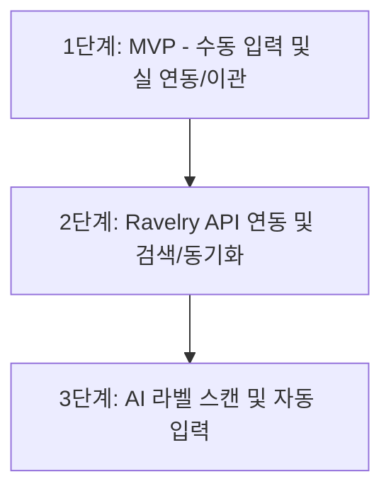

# 보관함(Stash) 기능 기획서

본 문서는 Yarnie 서비스에 추가될 '보관함(Stash)' 기능의 단계별 구현 계획 및 1단계 MVP 스펙을 정의합니다.

---

## 1. 기능 개요 및 목적

### 개요
- **보관함(Stash) 기능**은 사용자가 소유하고 있는 뜨개실의 정보를 기록하고 관리하는 기능입니다.
- **장기적인 확장성**을 고려하여, 초기에는 실(Yarn) 정보를 중심으로 설계하되, 향후 바늘(Needles) 및 기타 뜨개 도구(Tools)도 추가로 등록 및 관리할 수 있는 구조로 개발합니다.

### 목적
- 보유한 실의 재고(무게, 볼 수 등)를 파악하여 불필요한 이중 구매를 방지합니다.
- 프로젝트(Project) 생성 또는 진행 시, 보관함에 등록된 실을 프로젝트에 할당하여 작업에 매칭시킵니다.
- Ravelry 연동 및 AI 라벨 스캔 등의 고도화 단계를 통해 등록 편의성을 극대화합니다.

---

## 2. 단계별 도입 로드맵

현재는 **1단계(MVP)** 구현에 집중하며, 데이터베이스 구조는 향후 2, 3단계로 확장할 때 스키마 마이그레이션을 최소화할 수 있도록 Ravelry 데이터 구조를 적극 차용합니다.



### 1단계: MVP (현재 단계)
- **목표**: 사용자가 실 정보를 직접 수동으로 입력하여 저장 및 관리하고, 프로젝트와 보관함 실을 유기적으로 연동(N:N)하는 최소 기능 구현.
- **핵심**: Ravelry DB 구조를 차용한 로컬 데이터베이스(스키마) 설계 및 다대다(N:N) 프로젝트-실 연동 구조 도입.
- **주요 기능**:
  - 실 수동 등록/수정/삭제, 실 목록 조회(필터/정렬), 실 상세 조회.
  - 프로젝트 등록/수정 시 보관함의 다중 실 연동 기능 제공 (기존의 단순 텍스트 입력인 '로트 번호' 필드를 보관함 다중 실 연동 카드로 대체).
  - 이전 DB 버전(v2)의 프로젝트 내 `lotNumber` 데이터를 보관함 실 정보로 자동 변환하여 안전하게 보존하고 교차 테이블로 연동하는 마이그레이션(v2 -> v3) 수행.
  - 보관함 내 실 삭제(소프트 딜리트) 발생 시, 해당 실이 연동된 모든 프로젝트의 매핑 레코드를 정리하는 자동 연동 해제 정책 적용.

### 2단계: Ravelry API 연동
- **목표**: Ravelry API를 활용한 실 검색 및 자동 등록 기능 제공.
- **주요 기능**:
  - 브랜드 및 실 이름 검색을 통해 Ravelry DB로부터 실 정보(성분, 굵기, 표준 게이지 등) 가져오기.
  - 내 보관함과 Ravelry 데이터 동기화.

### 3단계: AI 라벨 스캔 고도화
- **목표**: 카메라 촬영을 통해 실 입력을 더욱 간편하게 제공.
- **주요 기능**:
  - 실 라벨지 사진 촬영 -> OCR 및 AI 분석으로 브랜드명, 실 이름 추출.
  - 추출된 정보를 바탕으로 Ravelry DB 검색 또는 자동 입력 폼 구성.

---

## 3. 기능 및 UI/UX 스펙 (1단계 MVP)

### 3.1. 화면 흐름 (UX Flow) 및 인터페이스 구조

1. **하단 네비게이션 구조 개편**:
   - 기존의 3탭(`Home` - `Projects` - `My`) 구조에서 보관함 메뉴를 추가한 **4탭(`Home` - `Projects` - `Stash` - `My`) 구조**로 개편합니다.
   - [root_scaffold.dart](file:///Users/rough/src/yarnie/lib/root/root_scaffold.dart) 및 다국어 번역 파일에 `Stash` (보관함) 항목을 신규 연동합니다.

2. **보관함 메인 (목록 화면)**:
   - 기존 프로젝트 목록 화면의 필터링/정렬/보기 모드 구조를 적극 벤치마킹합니다.
   - **보기 모드 제약 사항**: 프로젝트 목록의 3가지 레이아웃(Large Card, Small Card, List) 중 보관함 목록은 **`LargeCardView`를 제외하고 `SmallCardView` 및 `ListView` 2가지 모드만 제공**합니다.
   - 등록된 모든 실의 목록에서 브랜드, 제품명, 색상, 수량(볼/무게/길이) 정보가 한눈에 보이도록 구현합니다.
   - 검색창 및 정렬/필터(브랜드별, 굵기별, 색상 계열별, 태그별 등) 기능을 제공합니다.

3. **실 등록/수정 화면**:
   - 기존 `NewProjectScreen` ([new_project_screen.dart](file:///Users/rough/src/yarnie/lib/new_project_screen.dart))의 입력 폼 UI 설계(텍스트 필드, 이미지 피커, 태그 선택 등)를 참고하여 보관함 입력 폼을 일관성 있는 디자인으로 설계합니다.
   - 필수 값(`yarnName`)과 선택 값(기타 스펙 및 수량 정보 등)을 구분하여 제공합니다.
   - 실 목록 또는 실 선택 바텀 시트에서 바로 진입 가능하며, 등록 후 돌아올 때 이전 화면의 데이터가 갱신되어 새로 만든 실이 바로 반영됩니다.

4. **실 상세 화면**:
   - 등록된 실의 상세 정보(1볼당 무게/길이, 굵기, 성분, 보관 위치, 메모 등)를 조회합니다.
   - 남은 수량을 즉시 수정할 수 있는 간이 카운터 기능(볼 수 증감 등)을 제공합니다.
   - 해당 실을 사용 중인 프로젝트 목록("사용 중인 프로젝트" 영역)을 표시하며, 클릭 시 해당 프로젝트 화면으로 바로 이동할 수 있는 내비게이션을 제공합니다.

5. **프로젝트 등록/수정 화면과의 연동 (실 선택 바텀 시트 & 다중 연동)**:
   - 프로젝트 등록/수정 화면(`NewProjectScreen`)에서 기존 '로트 번호' 단일 텍스트 필드를 제거하고, **다중 실 연동 필드**를 추가합니다.
     - **초기 상태**: "보관함에서 실 추가" 버튼 노출.
     - **실 연동 시**: 연동된 모든 실에 대해 각각의 이미지, 이름(제품명/브랜드), 색상, 로트 번호 정보를 담은 카드 목록을 세로로 나열하며, 카드마다 개별 **"연동 해제" (link_off)** 버튼을 제공합니다.
     - 연동 카드 목록 하단에는 **[실 추가]** (OutlinedButton)를 항상 노출하여, 프로젝트에 여러 개의 실을 누적해서 연동(N:N)할 수 있게 합니다.
     - **실 선택 바텀 시트 (`StashYarnSelectionSheet`)**:
       - 보관함에 등록된 실 목록을 보여주며, 실을 선택하면 기존 연동 리스트에 추가(중복 선택은 방지)됩니다.
       - 실 목록이 비어 있는 경우(Empty state): 중앙에 "등록된 실이 없습니다..." 메시지와 함께 **[실 추가]** 버튼을 제공합니다.
       - 실 목록이 있는 경우: 바텀 시트 **우측 상단**에 **[실 추가]** 버튼을 상시 배치합니다.
       - 실 추가 완료 후 바텀 시트로 돌아올 때 실 목록이 자동으로 갱신(Re-fetch)되어 신규 실을 즉시 연동할 수 있게 구현합니다.

6. **프로젝트 상세 화면 (`ProjectInfoScreen`)과의 이동 흐름**:
   - 프로젝트 상세 화면의 기존 '실 로트 번호: [번호]' 영역을 연동된 **실 정보 카드 목록** 영역으로 대체합니다.
   - 연동된 실 목록이 존재할 경우 실 제품명, 브랜드명, 로트 번호를 각각 카드 형태로 노출하며, 특정 실 카드를 클릭하면 **해당 실의 상세 화면(`StashDetailScreen`)**으로 즉시 이동하여 사용자 동선을 단축합니다.

---

### 3.2. 입력 필드 스펙 및 Drift 매핑

| 분류 | 필드명 (Drift) | 데이터 타입 | 필수 여부 | 설명 | Ravelry 매핑 필드 |
| :--- | :--- | :--- | :--- | :--- | :--- |
| **기본 정보** | `id` | Int | 필수 (PK) | 로컬 고유 식별자 | - |
| | `remoteStashId` | Int | 선택 | Ravelry 내 보관함 항목 식별자 (동기화 기준) | `stash.id` |
| | `remoteYarnId` | Int | 선택 | 연동된 Ravelry 글로벌 실 사전 식별자 | `yarn.id` / `stash.yarn_id` |
| | `imagePath` | String | 선택 | 실 이미지 로컬 경로 또는 원격 URL | `stash.photos` |
| | `nickname` | String | 선택 | 실의 커스텀 별칭 (예: 파란색 조끼용 실) | `stash.name` |
| | `yarnName` | String | 필수 | 실 공식 이름 (제품명) | `yarn.name` |
| | `brandName` | String | 선택 | 브랜드/제조사 이름 | `yarn.yarn_company.name` |
| | `colorwayName` | String | 선택 | 색상명 또는 색상 번호 | `stash.colorway_name` |
| | `dyeLot` | String | 선택 | 염색 로트 번호 (Dye lot) | `stash.dye_lot` |
| **수량 및 규격** | `skeins` | Real | 선택 | 보유한 볼/타래 수량 (소수점 가능, 예: 3.3볼) | `stash.skeins` |
| | `yarnLengthPerSkein`| Real | 선택 | 1볼당 표준 길이 | `yarn.yardage` (m/yd 변환) |
| | `yarnWeightPerSkein`| Real | 선택 | 1볼당 표준 무게 (g/oz) | `yarn.grams` / `yarn.ounces` |
| | `totalLength` | Real | 선택 | 총 보유 길이 (자동 계산 또는 직접 입력) | `stash.total_length` |
| | `totalWeight` | Real | 선택 | 총 보유 무게 (자동 계산 또는 직접 입력) | `stash.total_weight` |
| | `lengthUnit` | String | 필수 (기본: `'yards'`) | 선택된 길이 단위 (`'yards'` / `'meters'`) | `stash.length_units` |
| | `weightUnit` | String | 필수 (기본: `'grams'`) | 선택된 무게 단위 (`'grams'` / `'ounces'`) | `stash.weight_units` |
| | `yarnWeight` | String | 선택 | 실 굵기 표준 분류 (아래 12가지 표준 명칭 중 택 1) | `yarn.yarn_weight.name` |
| **관리용** | `location` | String | 선택 | 보관 위치 (예: 안방 옷장 2층) | `stash.location` |
| | `notes` | String | 선택 | 성분 비율 등을 적는 자유 메모 | `stash.notes` |
| | `tagIds` | String | 선택 | 보관함 전용 태그 ID 목록 (JSON: `[1, 2, 3]`) | `stash.tag_names` |
| **시스템** | `createdAt` | DateTime | 필수 | 등록일시 | `stash.created_at` |
| | `updatedAt` | DateTime | 선택 | 수정일시 (동기화 충돌 방지용 필수) | `stash.updated_at` |

#### * yarnWeight (실 굵기) 표준 드롭다운 옵션
Ravelry 웹 화면과 100% 싱크를 맞추기 위해 아래 12가지 표준 굵기 데이터를 앱 UI의 드롭다운 목록으로 제공합니다:
1. `Thread`
2. `Cobweb`
3. `Lace`
4. `Light Fingering`
5. `Fingering (14 wpi)`
6. `Sport (12 wpi)`
7. `DK (11 wpi)`
8. `Worsted (9 wpi)`
9. `Aran (8 wpi)`
10. `Bulky (7 wpi)`
11. `Super Bulky (5-6 wpi)`
12. `Jumbo (0-4 wpi)`

---

## 4. 데이터베이스 구조 설계

유저가 구상한 Drift DB 구조와 Ravelry API 구조를 대조하여 최종 조율한 설계안입니다. 바늘 및 기타 뜨개 도구는 별도 테이블로 격리하고, 태그는 사용성 향상을 위해 보관함 전용 태그 테이블(`StashTags`)로 격리하여 관리합니다.

### 4.1. Drift 테이블 정의 (StashYarns, StashTags, Projects, ProjectStashYarns 교차 테이블)

```dart
/// StashYarns: 보관함 실 데이터 테이블 (바늘/도구와의 명확한 구분을 위해 StashYarns로 명명)
@DataClassName('StashYarn')
class StashYarns extends Table {
  // 1. 로컬 고유 ID (기본키)
  IntColumn get id => integer().autoIncrement()();

  // 2. 라벨리 동기화용 식별 정보
  IntColumn get remoteStashId => integer().nullable()(); // Ravelry stash_id 매핑
  IntColumn get remoteYarnId => integer().nullable()();  // Ravelry yarn_id 매핑
 
  // 3. 사진 경로 (로컬 파일 경로 또는 나중을 위한 원격 URL)
  TextColumn get imagePath => text().nullable()();

  // 4. 실 식별 정보
  TextColumn get nickname => text().nullable()();      // 유저가 붙인 별명 (예: 내 첫 스웨터 실)
  TextColumn get yarnName => text()();                 // 실제 실 제품명 (필수 값)
  TextColumn get brandName => text().nullable()();     // 브랜드/제조사명 (예: Cascade Yarns)
  TextColumn get colorwayName => text().nullable()();  // 색상 이름/번호 (예: Sapphire)
  TextColumn get dyeLot => text().nullable()();        // 탕 번호/염색 로트

  // 5. 수량 및 규격 (라벨리 명세 및 단위변환 구조 대응)
  RealColumn get skeins => real().nullable()();       // 보유 볼/타래 수 (Ravelry: skeins)
  RealColumn get yarnLengthPerSkein => real().nullable()(); // 1볼당 길이
  RealColumn get yarnWeightPerSkein => real().nullable()(); // 1볼당 무게
  RealColumn get totalLength => real().nullable()();  // 총 보유 길이
  RealColumn get totalWeight => real().nullable()();  // 총 보유 무게
  TextColumn get lengthUnit => text().withDefault(const Constant('yards'))(); // 'yards' or 'meters'
  TextColumn get weightUnit => text().withDefault(const Constant('grams'))(); // 'grams' or 'ounces'
  TextColumn get yarnWeight => text().nullable()();   // 굵기 규격 (Worsted 등)

  // 6. 기타 관리 정보
  TextColumn get location => text().nullable()();      // 보관 장소
  TextColumn get notes => text().nullable()();         // 자유 메모 (성분 비율 기입 등 포함)
  
  // 🏷️ 보관함 전용 태그 시스템 연동을 위한 JSON ID 목록 (예: '[1, 2]')
  TextColumn get tagIds => text().nullable()();

  // 7. 시스템 시간 관리
  DateTimeColumn get createdAt => dateTime().withDefault(currentDateAndTime)();
  DateTimeColumn get updatedAt => dateTime().nullable()();
  DateTimeColumn get deletedAt => dateTime().nullable()();
}

/// StashTags: 보관함용 독립형 태그 테이블 (프로젝트 태그와 완전히 분리하여 사용성 확보)
@TableIndex(name: 'stash_tags_name', columns: {#name}, unique: true)
class StashTags extends Table {
  IntColumn get id => integer().autoIncrement()();
  TextColumn get name => text()(); // 태그 이름
  IntColumn get color => integer()(); // 태그 색상 (0xFFRRGGBB)

  DateTimeColumn get createdAt =>
      dateTime().clientDefault(() => DateTime.now().toUtc())();
  DateTimeColumn get updatedAt => dateTime().nullable()();
}

/// Projects: Projects 테이블 명세
class Projects extends Table {
  IntColumn get id => integer().autoIncrement()();
  TextColumn get name => text()();
  TextColumn get needleType => text().nullable()();
  TextColumn get needleSize => text().nullable()();
  
  // 🔗 [변경] 기존 단일 lotNumber 텍스트 컬럼 및 단일 stashYarnId를 제거하고 다대다(N:N) 테이블로 분리
  
  TextColumn get memo => text().nullable()();
  TextColumn get gaugeStitches => text().nullable()();
  TextColumn get gaugeRows => text().nullable()();
  IntColumn get currentPartId => integer().nullable()();
  TextColumn get imagePath => text().nullable()();
  TextColumn get tagIds => text().nullable()();
  DateTimeColumn get deletedAt => dateTime().nullable()();
  DateTimeColumn get createdAt => dateTime().clientDefault(() => DateTime.now().toUtc())();
  DateTimeColumn get updatedAt => dateTime().nullable()();
}

/// ProjectStashYarns: 프로젝트와 보관함 실의 N:N 매핑을 처리하는 교차 테이블
class ProjectStashYarns extends Table {
  IntColumn get projectId => integer().references(Projects, #id, onDelete: KeyAction.cascade)();
  IntColumn get stashYarnId => integer().references(StashYarns, #id, onDelete: KeyAction.cascade)();

  @override
  Set<Column> get primaryKey => {projectId, stashYarnId};
}
```

### 4.2. 확장 고려 사항 및 테이블 격리

1. **바늘(Needles) 및 도구(Tools)의 격리**:
   - 보관함과 달리 바늘(대바늘/코바늘, mm 크기, 재질 등) 및 도구는 고유한 세부 속성을 가집니다.
   - 따라서 공통 테이블을 쓰지 않고 별도의 `StashNeedles`, `StashTools` 테이블을 정의하여 관리의 직관성을 보장합니다.
2. **태그 시스템의 완전 분리 (`StashTags`)**:
   - 프로젝트용 태그와 보관함용 태그가 서로 겹치지 않고 UI 상에서 섞여 나오는 혼란을 방지하기 위해, 보관함 전용 태그 테이블인 `StashTags`를 신규 구축하여 완벽히 독립적으로 관리합니다.
3. **성분 비율(Fibers)의 처리**:
   - Ravelry 구조와 1단계 입력 폼의 편의성을 고려하여 별도의 Fibers 테이블은 설계하지 않고, 사용자가 `notes` 필드에 텍스트 형태로 자유롭게 성분을 적도록 유도합니다.
4. **지능형 양방향 입력 방식과 단위 변환의 비즈니스 로직**:
   - **지능형 수량 입력**: 라벨리처럼 화면을 물리적으로 토글 분리하지 않고, 단일 등록 폼에서 유기적으로 양방향 자동 계산을 제공하여 사용성을 극대화합니다.
     - **경로 A**: 사용자가 `1볼당 규격 (무게/길이)`와 `보유 볼 수(skeins)`를 기입하면 -> `총 보유 무게/길이`가 실시간 자동 산출되어 DB에 함께 저장됩니다.
     - **경로 B**: `1볼당 규격`이 적힌 상태에서 유저가 저울로 잰 `총 보유 무게/길이`를 적으면 -> `보유 볼 수(skeins)`가 역산(총량 / 1볼 규격)되어 실시간 자동 기입됩니다.
     - **경로 C**: 1볼당 스펙을 아예 모를 경우, 1볼 규격과 skeins를 비워두고 `총 보유 무게/길이`만 수동으로 단독 기입하여 등록할 수도 있습니다.
   - **단위 변환**: `lengthUnit` 및 `weightUnit` 컬럼에 현재 선택된 단위 기준을 저장합니다. 사용자가 드롭다운 메뉴를 통해 단위를 변환(예: Yards ↔ Meters)하면, 입력된 수치에 환산 공식(1 Yard ≈ 0.9144 Meter, 1 Ounce ≈ 28.3495 Gram)을 곱하여 화면에 갱신 및 DB에 저장 처리합니다.

### 4.3. 마이그레이션 및 이전 DB 버전 데이터 보존 정책 (v2 -> v3)
- 이번 보관함 추가 및 프로젝트 실 연동 개발 사항은 **Drift DB 스키마 v3**로 정의 및 배포됩니다.
- 이전 데이터베이스 버전(v2)에서 업그레이드될 때, 프로젝트에 입력되었던 `lotNumber` 데이터를 보존하기 위해 트랜잭션 내에서 마이그레이션 스크립트를 수행합니다.
- **마이그레이션 정책**:
  1. `Projects` 테이블에서 `lotNumber`가 비어있지 않은 프로젝트를 모두 스캔합니다.
  2. 스캔된 프로젝트에 대해 임시 실 데이터를 생성하여 `StashYarns` 테이블에 삽입합니다. (제품명: `"기존 프로젝트 실 (자동 생성)"`, 브랜드명: `"이전 로트 번호 실"`, 염색 로트(`dyeLot`): 기존 프로젝트의 `lotNumber` 값)
  3. 삽입 후 리턴받은 실의 고유 ID(`id`)와 해당 프로젝트 ID(`projectId`) 관계를 **`ProjectStashYarns` 교차 테이블**에 연동하여 맵핑합니다.
  4. 이를 통해 기존 로트 번호 데이터의 유실을 차단하고, 구버전 사용자 데이터와의 정합성을 매끄럽게 보장합니다.

### 4.4. 실 소프트 딜리트 시 프로젝트 연동 자동 해제 정책
- 사용자가 보관함에서 실 정보를 삭제(소프트 딜리트, `deletedAt` 기록)할 때, 해당 실이 이미 연동되어 있는 프로젝트와의 연결성을 유지하는 것은 데이터 정합성에 맞지 않습니다.
- 따라서 실 소프트 딜리트 함수(`deleteStashYarn`) 내부적으로 DB 트랜잭션을 적용하여 다음을 일괄 수행합니다.
  1. 해당 실의 `deletedAt` 컬럼에 삭제 일시를 기록합니다.
  2. `ProjectStashYarns` 교차 테이블에서 해당 `stashYarnId`를 가진 모든 매핑 레코드를 물리적으로 영구 삭제(하드 딜리트)합니다.
- 이 정책을 통해 실 삭제 시 프로젝트 상세 화면 등에서 해당 실의 연동이 즉각적이고 안전하게 자동 해제되어 깨끗한 관계 데이터가 보장됩니다.

---

## 5. 1단계 도입 의사 결정 완료 사항

- **보유 볼/타래 수 및 규격 (지능형 통합 입력)**: Ravelry의 복잡한 2가지 모드를 하나의 단일 폼에서 양방향 자동 연산(Skeins ↔ Totals)으로 처리합니다. 이를 위해 `skeins`, `yarnLengthPerSkein`, `yarnWeightPerSkein`, `totalLength`, `totalWeight` 및 단위 컬럼들을 포함한 유연한 단일 스키마 설계를 확정했습니다.
- **테이블 명명 규칙 정의 (`StashYarns`)**: 향후 바늘(`StashNeedles`), 도구(`StashTools`)가 독자적으로 확장될 때 이름의 혼란을 방지하기 위해 보관함의 실 테이블명을 `StashYarns` (데이터 클래스 `StashYarn`)로 명명하기로 확정했습니다.
- **실 굵기(yarnWeight) 옵션**: Ravelry 웹 화면과 동일하게 `Thread`부터 `Jumbo`까지의 12가지 표준 드롭다운 메뉴 목록을 활용해 입력받도록 확정했습니다.
- **태그 테이블 분리**: 프로젝트 태그와 완전히 격리하기 위해 `StashTags` 테이블을 별도로 구성하고 `tagIds`를 매핑하는 형태로 확정했습니다.
- **프로젝트 및 보관함 실 연동 사양**: 프로젝트와 보관함의 실을 다대다(N:N) 관계 교차 테이블(`ProjectStashYarns`)로 구성하여, 프로젝트에 여러 개의 실을 동시에 연동 및 관리할 수 있도록 확정했습니다.
- **안전한 데이터 이관**: 기존의 `lotNumber`가 기록된 사용자 프로젝트들을 대상으로 임시 실(StashYarn)을 자동으로 등록 및 `ProjectStashYarns` 교차 테이블에 연동하는 마이그레이션 흐름(v2 -> v3)을 적용하기로 확정했습니다.
- **실 소프트 딜리트 시 자동 연동 정리**: 실 소프트 딜리트 수행 시, 교차 테이블의 관계 정보를 즉시 하드 딜리트하여 연동된 프로젝트들로부터 자동으로 연동이 해제되도록 정책을 확정했습니다.
